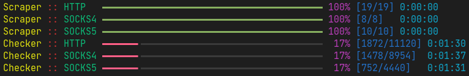

# proxy-scraper-checker

Check free anonymous HTTP, SOCKS4, SOCKS5 proxies from different sources. Supports determining exit-node's geolocation for each proxy.

For a version that uses Python's built-in `logging` instead of [rich](https://github.com/willmcgugan/rich), see the [simple-output](https://github.com/monosans/proxy-scraper-checker/tree/simple-output) branch.

You can get proxies obtained using this script in <https://github.com/monosans/proxy-list> (updated every 30 minutes).

## Usage

- Make sure `Python` version is 3.7 or higher.
- Install dependencies from `requirements.txt` (`python -m pip install -U -r requirements.txt`).
  - If you get an error while installing dependencies, remove the `cchardet<3.0.0` line from the `requirements.txt` file and try installing them again.
- Edit `config.py` according to your preference.
- Run `main.py`.

## Folders description

When the script finishes running, the following folders will be created:

- `proxies` - proxies with any anonymity level.

- `proxies_anonymous` - anonymous proxies.

- `proxies_geolocation` - same as `proxies`, but including exit-node's geolocation.

- `proxies_geolocation_anonymous` - same as `proxies_anonymous`, but including exit-node's geolocation.

Geolocation format is ip:port::Country::Region::City.

## Buy me a coffee

Ask for details in [Telegram](https://t.me/monosans) or [VK](https://vk.com/id607137534).

## License

[MIT](LICENSE)

This product includes GeoLite2 data created by MaxMind, available from <https://www.maxmind.com>.
